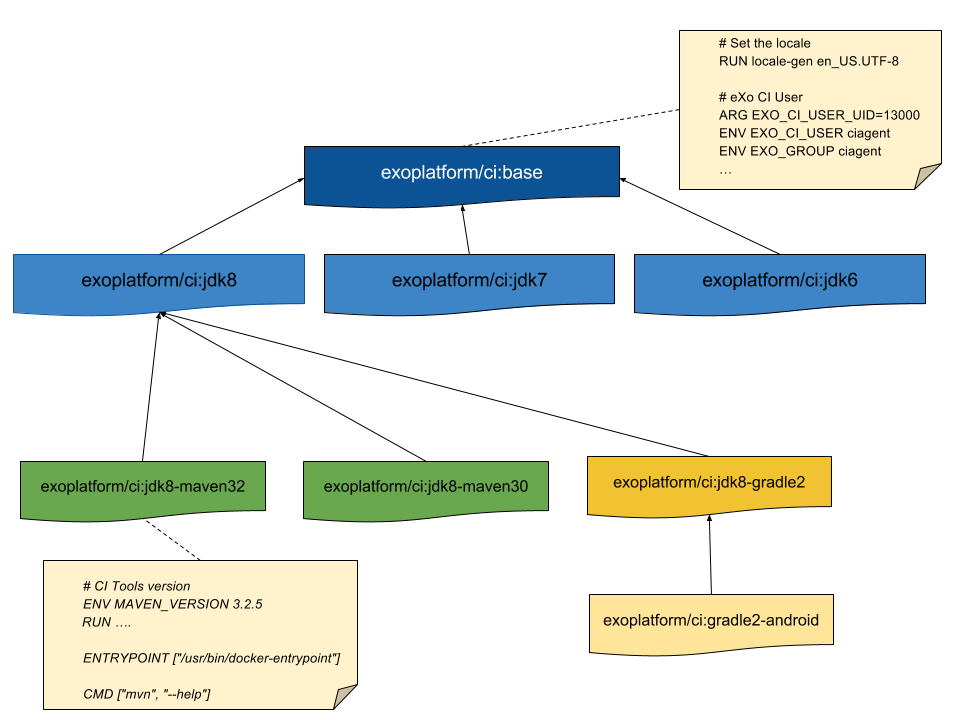

# eXo Docker Images for CI <!-- omit in toc -->

<!-- markdownlint-disable MD014 -->
 - 

- [Overview](#overview)
- [How to execute tests](#how-to-execute-tests)
- [How to use a eXo CI Docker Image](#how-to-use-a-exo-ci-docker-image)
  - [Basic Example with JDK7 - Maven 3.0](#basic-example-with-jdk7---maven-30)
  - [Advanced example with JDK8 - Maven 3.2 and Release Profile](#advanced-example-with-jdk8---maven-32-and-release-profile)
- [How to use eXo Puppet Docker Image](#how-to-use-exo-puppet-docker-image)
- [XMLStarlet](#xmlstarlet)
- [Developer configuration](#developer-configuration)
  - [Configure your .bash_profile](#configure-your-bash_profile)
  - [Build with the right configuration](#build-with-the-right-configuration)

The aim of this repository is to give the configuration to **build all eXo Platform components in Docker containers** for Development and Continous Integration purpose.

It contains **Dockerfiles, Tests and configuration** for the following CI Images:

|    Image                            |  JDK        | Python   | GCC |   Build tool   |  Tests
|-------------------------------------|-------------|----------|-----|----------------|------------
| exoplatform/ci:base                 |   n/a       | 2.7 & 3  | 4.8 | n/a            | [goss.yaml](base/tests/goss.yaml)
| exoplatform/ci:jdk6                 |   1.6.0_45  | 2.7 & 3  | 4.8 | n/a            | [goss.yaml](jdk/jdk6/tests/goss.yaml)
| exoplatform/ci:jdk7                 |   1.7.0_80  | 2.7 & 3  | 4.8 | n/a            | [goss.yaml](jdk/jdk7/tests/goss.yaml)
| exoplatform/ci:jdk8                 |   1.8.0_181 | 2.7 & 3  | 4.8 | n/a            | [goss.yaml](jdk/jdk8/tests/goss.yaml)
| exoplatform/ci:jdk11                |   11.0.14   | 2.7 & 3  | 4.8 | n/a            | [goss.yaml](jdk/jdk11/tests/goss.yaml)
| exoplatform/ci:jdk8-gradle2         |   1.8.0_181 | 2.7 & 3  | 4.8 | Gradle 2.14    | [goss.yaml](jdk/jdk8-gradle2/tests/goss.yaml)
| exoplatform/ci:jdk8-gradle2-android |   1.8.0_181 | 2.7 & 3  | 4.8 | Gradle 2.14 / Android 23/24    | [goss.yaml](gradle/jdk8-gradle2-android/tests/goss.yaml)
| exoplatform/ci:jdk8-gradle4         |   1.8.0_181 | 2.7 & 3  | 4.8 | Gradle 4.1    | [goss.yaml](jdk/jdk8-gradle4/tests/goss.yaml)
| exoplatform/ci:jdk8-gradle4-android |   1.8.0_181 | 2.7 & 3  | 4.8 | Gradle 4.1 / Android 23/24/25/26/27    | [goss.yaml](gradle/jdk8-gradle4-android/tests/goss.yaml)
| exoplatform/ci:jdk8-gradle6         |   1.8.0_181 | 2.7 & 3  | 4.8 | Gradle 6.1    | [goss.yaml](jdk/jdk8-gradle4/tests/goss.yaml)
| exoplatform/ci:jdk8-gradle6-android |   1.8.0_181 | 2.7 & 3  | 4.8 | Gradle 6.1 / Android 23/24/25/26/27    | [goss.yaml](gradle/jdk8-gradle4-android/tests/goss.yaml)
| exoplatform/ci:jdk6-maven30         |   1.6.0_45  | 2.7 & 3  | 4.8 | Maven 3.0.5    | [goss.yaml](maven/jdk6-maven30/tests/goss.yaml)
| exoplatform/ci:jdk6-maven32         |   1.6.0_45  | 2.7 & 3  | 4.8 | Maven 3.2.5    | [goss.yaml](maven/jdk6-maven32/tests/goss.yaml)
| exoplatform/ci:jdk7-maven30         |   1.7.0_80  | 2.7 & 3  | 4.8 | Maven 3.0.5    | [goss.yaml](maven/jdk7-maven30/tests/goss.yaml)
| exoplatform/ci:jdk7-maven32         |   1.7.0_80  | 2.7 & 3  | 4.8 | Maven 3.2.5    | [goss.yaml](maven/jdk7-maven32/tests/goss.yaml)
| exoplatform/ci:jdk8-maven30         |   1.8.0_181 | 2.7 & 3  | 4.8 | Maven 3.0.5    | [goss.yaml](maven/jdk8-maven30/tests/goss.yaml)
| exoplatform/ci:jdk8-maven32         |   1.8.0_181 | 2.7 & 3  | 4.8 | Maven 3.2.5    | [goss.yaml](maven/jdk8-maven32/tests/goss.yaml)
| exoplatform/ci:jdk8-maven33         |   1.8.0_181 | 2.7 & 3  | 4.8 | Maven 3.3.9    | [goss.yaml](maven/jdk8-maven33/tests/goss.yaml)
| exoplatform/ci:jdk8-maven35         |   1.8.0_181 | 2.7 & 3  | 4.8 | Maven 3.5.4    | [goss.yaml](maven/jdk8-maven35/tests/goss.yaml)
| exoplatform/ci:jdk11-maven32        |   11.0.14   | 2.7 & 3  | 4.8 | Maven 3.2.5    | [goss.yaml](maven/jdk11-maven32/tests/goss.yaml)
| exoplatform/ci:jdk11-maven33        |   11.0.14   | 2.7 & 3  | 4.8 | Maven 3.3.9    | [goss.yaml](maven/jdk11-maven33/tests/goss.yaml)
| exoplatform/ci:jdk11-maven35        |   11.0.14   | 2.7 & 3  | 4.8 | Maven 3.5.4    | [goss.yaml](maven/jdk11-maven35/tests/goss.yaml)
| exoplatform/ci:jdk11-maven36        |   11.0.14   | 2.7 & 3  | 4.8 | Maven 3.6.3    | [goss.yaml](maven/jdk11-maven36/tests/goss.yaml)
| exoplatform/ci:jdk11-maven38        |   11.0.14   | 2.7 & 3  | 4.8 | Maven 3.8.5    | [goss.yaml](maven/jdk11-maven38/tests/goss.yaml)
| exoplatform/ci:jdk14-maven32        |   14.0.2   | 2.7 & 3  | 4.8 | Maven 3.2.5    | [goss.yaml](maven/jdk14-maven32/tests/goss.yaml)
| exoplatform/ci:jdk14-maven33        |   14.0.2   | 2.7 & 3  | 4.8 | Maven 3.3.9    | [goss.yaml](maven/jdk14-maven33/tests/goss.yaml)
| exoplatform/ci:jdk14-maven35        |   14.0.2   | 2.7 & 3  | 4.8 | Maven 3.5.4    | [goss.yaml](maven/jdk14-maven35/tests/goss.yaml)
| exoplatform/ci:jdk14-maven36        |   14.0.2   | 2.7 & 3  | 4.8 | Maven 3.6.3    | [goss.yaml](maven/jdk14-maven36/tests/goss.yaml)
| exoplatform/ci:jdk14-maven38        |   14.0.2   | 2.7 & 3  | 4.8 | Maven 3.8.5    | [goss.yaml](maven/jdk14-maven38/tests/goss.yaml)
| exoplatform/ci:jdk17-maven32        |   17.0.1   | 2.7 & 3  | 4.8 | Maven 3.2.5    | [goss.yaml](maven/jdk17-maven32/tests/goss.yaml)
| exoplatform/ci:jdk17-maven33        |   17.0.1   | 2.7 & 3  | 4.8 | Maven 3.3.9    | [goss.yaml](maven/jdk17-maven33/tests/goss.yaml)
| exoplatform/ci:jdk17-maven35        |   17.0.1   | 2.7 & 3  | 4.8 | Maven 3.5.4    | [goss.yaml](maven/jdk17-maven35/tests/goss.yaml)
| exoplatform/ci:jdk17-maven36        |   17.0.1   | 2.7 & 3  | 4.8 | Maven 3.6.3    | [goss.yaml](maven/jdk17-maven36/tests/goss.yaml)
| exoplatform/ci:jdk17-maven38        |   17.0.1   | 2.7 & 3  | 4.8 | Maven 3.8.5    | [goss.yaml](maven/jdk17-maven38/tests/goss.yaml)

## Overview

This diagram show an overview of the inheritance in eXo CI Docker images:



## How to execute tests

**To run tests, you have to install [dgoss](https://github.com/aelsabbahy/goss/tree/master/extras/dgoss)**

You can build and test all images by running the script:

```bash
$ ./test_all_images.sh
```

If you want to execute test on a specific Docker image:

```bash
$ cd maven/jdk7-maven32/tests
$ ./test_image.sh

INFO: Starting docker container
INFO: Container ID: 59897f6f
INFO: Sleeping for 0.2
INFO: Running Tests
Title: Validating the presence of eXo GLOBAL settings file
File: /usr/share/maven/conf/settings.xml: exists: matches expectation: [true]
Title: Validating the presence Maven repository folder
File: /home/ciagent/.m2/repository: exists: matches expectation: [true]
Title: Validating the absence of eXo USER settings file
File: /home/ciagent/.m2/settings.xml: exists: matches expectation: [false]
Title: Check that git is installed
Package: git: installed: matches expectation: [true]
Command: mvn --version: exit-status: matches expectation: [0]
Command: mvn --version: stdout: matches expectation: [3.2.5 1.7.0 Default locale: en_US, platform encoding: UTF-8]


Total Duration: 0.650s
Count: 6, Failed: 0, Skipped: 0
INFO: Deleting container

real    0m2.929s
user    0m0.064s
sys     0m0.288s
```

## How to use a eXo CI Docker Image

### Basic Example with JDK7 - Maven 3.0

```bash
$ cd my-project
$ docker run --name=my-project-build -it -v $(pwd):/srv/ciagent/workspace \
     -v ~/.m2/repository:/home/ciagent/.m2/repository \
     -v ~/.m2/settings.xml:/home/ciagent/.m2/settings.xml \
     exoplatform/ci:jdk7-maven30 clean package
```

### Advanced example with JDK8 - Maven 3.2 and Release Profile

```bash
$ cd my-project
$ docker run --name=my-project-build -it -v $(pwd):/srv/ciagent/workspace \
     -v ~/.m2/repository:/home/ciagent/.m2/repository \
     -v ~/.m2/settings.xml:/home/ciagent/.m2/settings.xml \
     -v ~/.gnupg/pubring.gpg:/home/ciagent/.gnupg/pubring.gpg:ro \
     -v ~/.gnupg/secring.gpg:/home/ciagent/.gnupg/secring.gpg:ro \
     -v ~/.gnupg/gpg.conf:/home/ciagent/.gnupg/gpg.conf:ro \
     exoplatform/ci:jdk8-maven32 install -Prelease
```

## How to use eXo Puppet Docker Image

```bash
$ cd my-project
$ docker run --name puppet-validation -it -v ${PWD}:/srv/ciagent/workspace \
      exoplatform/ci:puppet
```

You can specify the `-u` option to force the modules update via `r10k`
Example :

```bash
$ docker run --name puppet-validation -it -v ${PWD}:/srv/ciagent/workspace \
      exoplatform/ci:puppet -u
```

## XMLStarlet

XMLStarlet is a set of command line utilities (tools) which can be used to transform, query, validate, and edit XML documents and files using simple set of shell commands in similar way it is done for plain text files using UNIX grep, sed, awk, diff, patch, join, etc commands.

- <http://xmlstar.sourceforge.net/doc/UG/xmlstarlet-ug.html#idm47077139729008>

At eXo, we use it to update Maven POM XML files for FB and Translation process.

examples:

```bash
$ cd /tmp/xmlstarlet
$ wget https://raw.githubusercontent.com/exoplatform/maven-parent-pom/develop/pom.xml
$ docker run -it --rm --name=xmlstartlet  -v $(pwd):/srv/ciagent/workspace --entrypoint=/bin/bash  exoplatform/ci:jdk8-maven32

# Update POM version from X-SNAPSHOT to X-translation-SNAPSHOT
ciagent@b32b684a1d6b:/srv/ciagent/workspace$ xmlstarlet ed --inplace -N pom=http://maven.apache.org/POM/4.0.0 \
  -u '/pom:project/pom:version[contains(text(), "-SNAPSHOT")]' \
  -x "concat(substring-before(.,'-SNAPSHOT'), '-translation-SNAPSHOT')" \
  pom.xml

# Update all POMs files in a Maven reactor project
ciagent@b32b684a1d6b:/srv/ciagent/workspace$ find . -name pom.xml | xargs -t -n 1 xmlstarlet ed -P --inplace -N pom=http://maven.apache.org/POM/4.0.0 -u '/pom:project/pom:version[contains(text(), "-SNAPSHOT")]' -x "concat(substring-before(.,'-SNAPSHOT'), '-translation-SNAPSHOT')"
```

## Developer configuration

### Configure your .bash_profile

In order to quickly run build with different stack (Maven and JDK), you can configure your `.bash_profile` file with the following alias:

```bash
#!/bin/bash
# Run Maven commands in Containers

c-mvn(){
      mvnInContainer "exoplatform/ci:jdk8-maven33" "$@"
}
jdk8mvn32(){
      mvnInContainer "exoplatform/ci:jdk8-maven32" "$@"
}

jdk8mvn30(){
      mvnInContainer "exoplatform/ci:jdk8-maven30" "$@"
}

jdk7mvn32(){
      mvnInContainer "exoplatform/ci:jdk7-maven32" "$@"
}

jdk7mvn30(){
      mvnInContainer "exoplatform/ci:jdk7-maven30" "$@"
}

jdk6mvn30(){
      mvnInContainer "exoplatform/ci:jdk6-maven30" "$@"
}

# Run Maven commands in a container
mvnInContainer(){
      local dockerImage=$1

      docker run --rm \
        -v $(pwd):/srv/ciagent/workspace \
        -v ~/.gnupg/gpg.conf:/home/ciagent/.gnupg/gpg.conf:ro \
        -v ~/.gnupg/pubring.gpg:/home/ciagent/.gnupg/pubring.gpg:ro \
        -v ~/.gnupg/secring.gpg:/home/ciagent/.gnupg/secring.gpg:ro \
        -v ~/.gnupg/trustdb.gpg:/home/ciagent/.gnupg/trustdb.gpg:ro \
        -v ~/.gnupg:/home/ciagent/.gnupg \
        -v ~/.m2/repository:/home/ciagent/.m2/repository \
        -v ~/.m2/settings.xml:/home/ciagent/.m2/settings.xml \
        --workdir /srv/ciagent/workspace \
        ${dockerImage} "${@:2}"
}
puppet_validate(){
docker run --name puppet-validation -it -v ${PWD}:/srv/ciagent/workspace \
      exoplatform/ci:puppet $*
}
```

### Build with the right configuration

```bash
$ source ~/.bash_profile
$ cd my-project
$ jdk8mvn32 clean package
```
